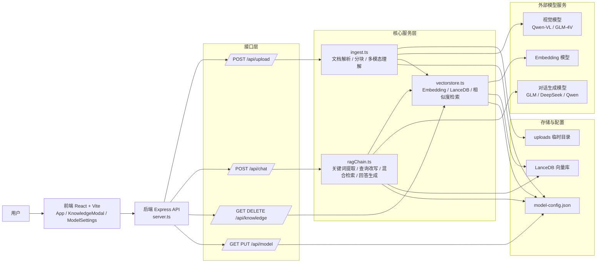
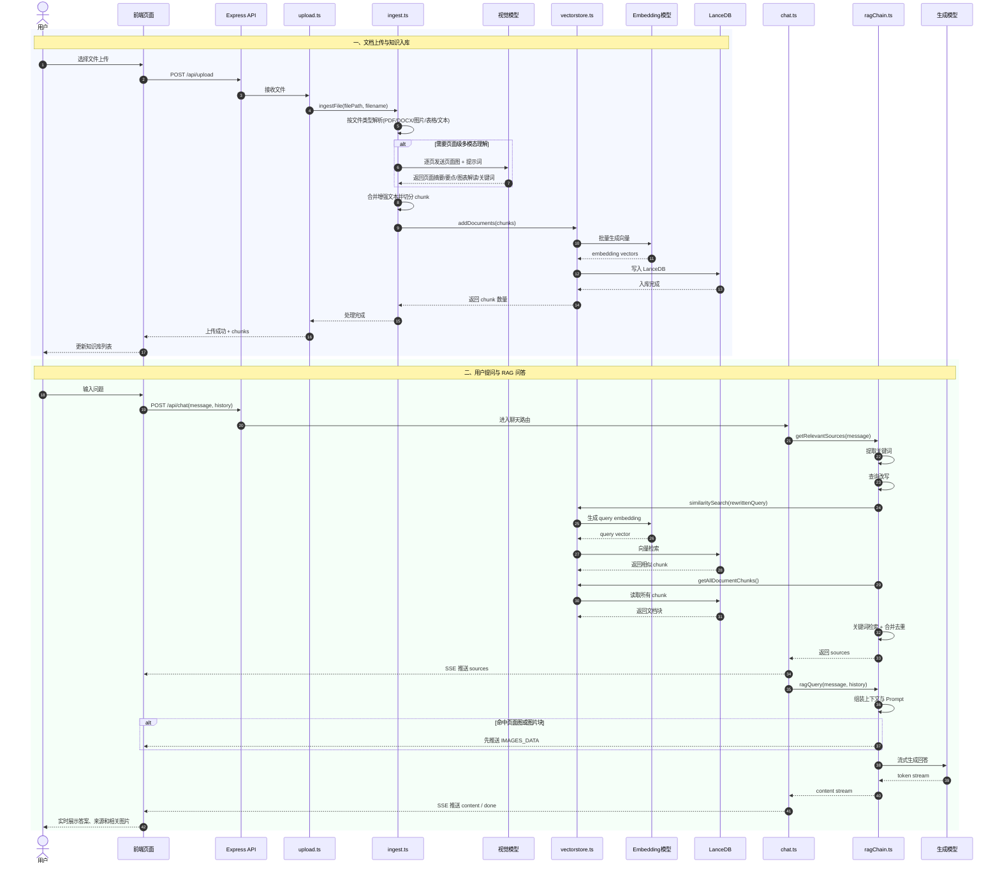

# 知识库助手项目架构图与时序图

本文基于当前项目代码实现整理，覆盖两个核心流程：

- 文档上传与知识入库
- 用户提问与 RAG 问答

## 项目架构图

## 关键说明

- 前端负责会话管理、知识库管理、模型配置和流式消息展示。
- 后端 `server.ts` 负责服务初始化、路由挂载和健康检查。
- `ingest.ts` 是入库入口，负责把不同格式文件统一转成可检索文本，并保留页面图像引用。
- `vectorstore.ts` 负责调用 embedding、写入 LanceDB、执行向量检索，以及知识库文档管理。
- `ragChain.ts` 负责查询预处理、混合检索、组装上下文、调用大模型流式生成回答。
- 当前项目的特色是“多模态 RAG”：文档不只抽纯文本，还会对页面图、图表、截图做整页理解。

## 时序图

## 代码定位

- 服务入口：[backend/src/server.ts](C:/Users/Administrator.DESKTOP-VH55UL7/Desktop/aoneng/rag-knowledge-assistant/backend/src/server.ts)
- 上传路由：[backend/src/routes/upload.ts](C:/Users/Administrator.DESKTOP-VH55UL7/Desktop/aoneng/rag-knowledge-assistant/backend/src/routes/upload.ts)
- 聊天路由：[backend/src/routes/chat.ts](C:/Users/Administrator.DESKTOP-VH55UL7/Desktop/aoneng/rag-knowledge-assistant/backend/src/routes/chat.ts)
- 知识库管理：[backend/src/routes/knowledge.ts](C:/Users/Administrator.DESKTOP-VH55UL7/Desktop/aoneng/rag-knowledge-assistant/backend/src/routes/knowledge.ts)
- 模型配置：[backend/src/routes/model.ts](C:/Users/Administrator.DESKTOP-VH55UL7/Desktop/aoneng/rag-knowledge-assistant/backend/src/routes/model.ts)
- 入库服务：[backend/src/services/ingest.ts](C:/Users/Administrator.DESKTOP-VH55UL7/Desktop/aoneng/rag-knowledge-assistant/backend/src/services/ingest.ts)
- RAG 服务：[backend/src/services/ragChain.ts](C:/Users/Administrator.DESKTOP-VH55UL7/Desktop/aoneng/rag-knowledge-assistant/backend/src/services/ragChain.ts)
- 向量存储：[backend/src/services/vectorstore.ts](C:/Users/Administrator.DESKTOP-VH55UL7/Desktop/aoneng/rag-knowledge-assistant/backend/src/services/vectorstore.ts)
- 前端入口：[frontend/src/App.tsx](C:/Users/Administrator.DESKTOP-VH55UL7/Desktop/aoneng/rag-knowledge-assistant/frontend/src/App.tsx)
- 前端 API 封装：[frontend/src/api.ts](C:/Users/Administrator.DESKTOP-VH55UL7/Desktop/aoneng/rag-knowledge-assistant/frontend/src/api.ts)
