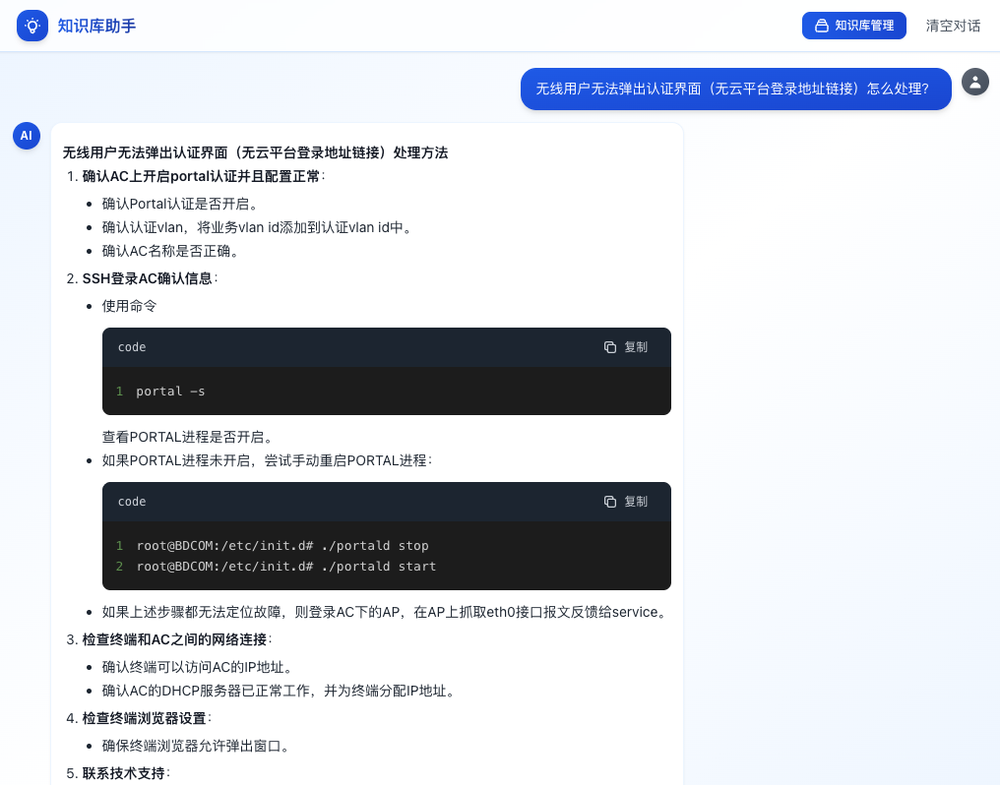

<div align="center">

# 🤖 智能知识库助手

**基于 RAG 技术的智能文档问答系统**

[](https://opensource.org/licenses/MIT)
[](https://nodejs.org/)
[](https://reactjs.org/)
[](https://www.typescriptlang.org/)

[English](README_EN.md) | 简体中文

</div>

---

## 📖 项目简介

一个开箱即用的 **RAG（检索增强生成）** 智能问答系统，让你的文档"活"起来！

上传你的文档（PDF、Word、Markdown、TXT），系统会自动理解内容，然后你就可以用自然语言提问，获得基于文档内容的精准回答。就像拥有一个读过所有文档的智能助手！

### 💡 为什么选择这个项目？

**🎯 专为前端开发者设计**

- 纯 JavaScript/TypeScript 技术栈，无需学习 Python
- 熟悉的 Node.js + React 组合，上手零门槛
- 完整的类型定义，开发体验友好
- 详细的代码注释，易于理解和修改

**🚀 真正的开箱即用**

- 无需配置复杂的 Python 环境
- 无需下载几十 GB 的本地模型
- 无需 GPU 或高性能服务器
- 只需 Node.js 和一个 API Key，5 分钟启动

**📚 完整的学习资源**

- 清晰的项目结构，适合学习 RAG 技术
- 从文档处理到向量检索的完整流程
- 可以作为你的 AI 应用开发起点

### 🎯 核心特性

- 🚀 **开箱即用** - 5 分钟完成部署，无需复杂配置
- 📚 **多格式支持** - PDF、DOCX、Markdown、TXT 一键上传
- 🧠 **智能理解** - 基于向量检索的语义搜索，理解你的真实意图
- 💬 **流式对话** - 实时显示 AI 思考过程，体验流畅
- 🎨 **现代界面** - 简洁美观的设计，支持代码高亮和 Markdown 渲染
- 🔒 **隐私安全** - 数据存储在本地，完全可控
- ⚡ **性能优化** - 混合检索策略，快速准确
- 🌐 **完全在线** - 无需本地模型，使用智谱 AI 云服务

### 🎬 效果演示

````
用户：如何刷新 token？

助手：根据文档，需要刷新 token 的场景包括：

1. **Token 过期时**
   - 当 API 返回 401 错误时
   - Token 有效期通常为 2 小时

2. **刷新方法**
   ```javascript
   const newToken = await refreshToken(oldToken);
````

📄 来源：API 接入文档.pdf

````

---

## 🏗️ 技术架构

<div align="center">

```mermaid
graph LR
    A[用户上传文档] --> B[文档解析]
    B --> C[文本分块]
    C --> D[向量化]
    D --> E[LanceDB 存储]

    F[用户提问] --> G[查询优化]
    G --> H[混合检索]
    H --> I[向量检索]
    H --> J[关键词检索]
    I --> K[相关文档]
    J --> K
    K --> L[GLM-4 生成回答]
    L --> M[流式输出]
````

</div>

### 技术栈

**前端（熟悉的技术）**

- React 18 + TypeScript + Vite
- TailwindCSS - 现代化样式
- React Markdown - Markdown 渲染
- Prism.js - 代码高亮

**后端（纯 JavaScript）**

- Node.js + Express + TypeScript
- LangChain.js - AI 应用框架（JavaScript 版本）
- LanceDB - 向量数据库（无需额外安装）
- Multer - 文件处理

**AI 服务（云端调用）**

- 智谱 GLM-4 系列模型
  - `glm-4-flash` - 快速响应（推荐）
  - `glm-4.6` - 高质量回答
- Embedding-3 - 向量化模型

> 🎉 **100% JavaScript/TypeScript**：从前端到后端，从数据处理到 AI 调用，全部使用你熟悉的技术栈！

---

## 为什么前端开发者会喜欢这个项目？

### 🎯 技术栈友好

```
传统 AI 项目                    本项目
━━━━━━━━━━━━━━━━━━━━━━━━━━━━━━━━━━━━━━━━━━━━━━
Python + PyTorch         →     Node.js + TypeScript
Conda 环境配置           →     npm install
本地模型下载 (50GB+)     →     API 调用 (0 安装)
GPU 服务器               →     普通电脑即可
复杂的依赖管理           →     package.json 搞定
```

### 💡 学习曲线平缓

- ✅ 使用你已经熟悉的 JavaScript/TypeScript
- ✅ 熟悉的 npm/yarn 包管理
- ✅ 熟悉的 Express 后端框架
- ✅ 熟悉的 React 前端开发
- ✅ 清晰的代码结构，易于理解

### 🚀 快速上手

```bash
# 传统 AI 项目
conda create -n ai python=3.10
conda activate ai
pip install torch torchvision torchaudio --index-url ...
pip install transformers accelerate bitsandbytes ...
# 下载模型...等待 1 小时...

# 本项目
npm install  # 30 秒搞定
npm run dev  # 立即启动
```

### 🎓 完整的学习资源

这个项目不仅是一个工具，更是一个学习 RAG 技术的完整案例：

- 📚 **文档处理**：学习如何解析 PDF、Word 等格式
- 🔍 **向量检索**：理解语义搜索的原理
- 🤖 **AI 集成**：掌握 LangChain.js 的使用
- 💬 **流式输出**：实现实时对话体验
- 🎨 **UI 设计**：现代化的聊天界面

### 🛠️ 易于扩展

基于这个项目，你可以轻松扩展：

- 🔌 接入其他 AI 模型（OpenAI、DeepSeek 等）
- 📊 添加数据分析功能
- 🌐 部署到云服务器
- 📱 开发移动端应用
- 🔗 集成到现有项目

---

## 🚀 快速开始

### 前置要求

只需要两样东西，就这么简单！

- **Node.js 18+** - [下载地址](https://nodejs.org/)（前端开发者必备）
- **智谱 API Key** - [免费获取](https://open.bigmodel.cn/)（新用户有免费额度，注册即用）

> 💡 **对前端开发者友好**：不需要 Python、不需要 CUDA、不需要 GPU，只要你会 Node.js 就能玩转 AI！

### 一键启动

```bash
# 1. 克隆项目
git clone https://github.com/jinghaonode/rag-knowledge-assistant.git
cd rag-knowledge-assistant

# 2. 配置 API Key
cp backend/.env.example backend/.env
# 编辑 backend/.env，填入你的智谱 API Key

# 3. 启动服务
./start.sh          # macOS/Linux
start.bat           # Windows
```

### 手动启动

```bash
# 后端
cd backend
npm install
npm run dev

# 前端（新终端）
cd frontend
npm install
npm run dev
```

### 访问应用

- 🌐 前端界面：http://localhost:5173
- 🔌 后端 API：http://localhost:3001

---

## ⚙️ 配置说明

### 基础配置

编辑 `backend/.env` 文件：

```env
# API 配置
GLM_API_KEY=your_api_key_here              # 智谱 API Key
GLM_BASE_URL=https://open.bigmodel.cn/api/paas/v4
GLM_EMBEDDING_MODEL=embedding-3

# 模型选择
GLM_MODEL=glm-4-flash                      # 或 glm-4.6

# RAG 优化
USE_FAST_PREPROCESSING=true                # 快速预处理
```

### 模型选择

| 模型          | 响应速度        | 回答质量      | 适用场景           |
| ------------- | --------------- | ------------- | ------------------ |
| `glm-4-flash` | ⚡⚡⚡ 快 (~1s) | ⭐⭐⭐ 良好   | 日常问答、快速响应 |
| `glm-4.6`     | ⚡⚡ 中等 (~3s) | ⭐⭐⭐⭐ 优秀 | 复杂问题、深度分析 |

**推荐配置**：

- 开发测试：`glm-4-flash` + `USE_FAST_PREPROCESSING=false`
- 生产环境：`glm-4.6` + `USE_FAST_PREPROCESSING=true`

详细配置说明：[MODEL_CONFIG.md](backend/MODEL_CONFIG.md)

### 获取 API Key

1. 访问 [智谱 AI 开放平台](https://open.bigmodel.cn/)
2. 注册并登录账号
3. 进入控制台 → API 管理 → 创建 API Key
4. 复制 Key 到 `.env` 文件

💡 **提示**：新用户有免费额度，足够测试使用！

---

## 📖 使用指南

### 1️⃣ 上传文档

<div align="center">
  
</div>

- 点击右上角 **"知识库管理"**
- 点击 **"上传文档"** 或直接拖拽文件
- 支持格式：PDF、DOCX、MD、TXT
- 支持批量上传

### 2️⃣ 智能问答

<div align="center">
  
</div>

- 在输入框输入问题
- 系统自动检索相关文档
- 实时显示 AI 回答
- 查看引用来源

### 3️⃣ 管理知识库

- 查看已上传文档列表
- 查看文档分块数量
- 删除不需要的文档
- 一键清空知识库

---

## 🎯 核心功能

### 🔍 智能检索

采用 **混合检索策略**，结合向量检索和关键词匹配：

1. **查询优化** - 自动提取关键词，优化检索效果
2. **向量检索** - 基于语义相似度，理解问题意图
3. **关键词检索** - 精确匹配重要术语
4. **智能过滤** - 自动过滤低相关度文档
5. **结果合并** - 去重排序，返回最相关内容

### 💬 流式对话

- 实时显示 AI 生成过程
- 支持 Markdown 格式
- 代码块语法高亮
- 表格完整渲染
- 一键复制代码

### 📚 文档处理

- 自动文本提取
- 智能分块（500 字符/块，100 字符重叠）
- 向量化存储
- 支持大文件处理

---

## 📁 项目结构

```
rag-knowledge-assistant/
├── 📂 backend/                    # 后端服务
│   ├── 📂 src/
│   │   ├── 📄 server.ts          # Express 服务器
│   │   ├── 📂 routes/            # API 路由
│   │   │   ├── chat.ts           # 聊天接口
│   │   │   ├── upload.ts         # 上传接口
│   │   │   └── knowledge.ts      # 知识库管理
│   │   ├── 📂 services/          # 核心服务
│   │   │   ├── vectorstore.ts    # 向量存储
│   │   │   └── ragChain.ts       # RAG 检索链
│   │   └── 📄 types.ts           # 类型定义
│   ├── 📄 .env.example           # 环境变量模板
│   └── 📄 MODEL_CONFIG.md        # 模型配置说明
├── 📂 frontend/                   # 前端应用
│   ├── 📂 src/
│   │   ├── 📂 components/        # React 组件
│   │   │   ├── ChatMessage.tsx   # 消息组件
│   │   │   ├── ChatInput.tsx     # 输入组件
│   │   │   └── KnowledgeModal.tsx # 知识库管理
│   │   ├── 📄 App.tsx            # 主应用
│   │   └── 📄 index.css          # 全局样式
│   └── 📄 tailwind.config.js     # Tailwind 配置
├── 📂 lancedb/                    # 向量数据库（自动生成）
├── 📄 start.sh / start.bat        # 启动脚本
├── 📄 stop.sh / stop.bat          # 停止脚本
└── 📄 README.md                   # 项目文档
```

---

## 🔧 开发指南

### 本地开发

```bash
# 后端开发（热重载）
cd backend
npm run dev

# 前端开发（热重载）
cd frontend
npm run dev
```

### 构建生产版本

```bash
# 后端构建
cd backend
npm run build

# 前端构建
cd frontend
npm run build
```

### 测试 API

```bash
# 测试智谱 API 连接
node backend/test-zhipu-api.js

# 测试嵌入模型
node backend/test-embedding.mjs
```

---

## 🎨 自定义配置

### 修改主题颜色

编辑 `frontend/tailwind.config.js`：

```javascript
module.exports = {
  theme: {
    extend: {
      colors: {
        primary: "#3b82f6", // 修改主色调
      },
    },
  },
};
```

### 调整检索参数

编辑 `backend/src/services/ragChain.ts`：

```typescript
// 调整检索数量
const vectorDocs = await vectorStore.similaritySearch(query, 6);

// 调整相似度阈值
const minScore = 0.45;

// 调整文档块大小
const chunkSize = 500;
const chunkOverlap = 100;
```

---

## 🚀 性能优化

### 已实现的优化

- ✅ **混合检索** - 向量 + 关键词，提高准确率
- ✅ **智能过滤** - 自动过滤低相关度文档
- ✅ **查询优化** - 关键词提取和查询改写
- ✅ **快速预处理** - 使用 glm-4-flash 加速
- ✅ **流式输出** - 实时显示，提升体验
- ✅ **文档分块** - 优化 Token 使用

### 性能指标

| 指标         | 数值    |
| ------------ | ------- |
| 首次响应时间 | < 2s    |
| 文档上传速度 | ~1MB/s  |
| 向量检索速度 | < 100ms |
| 并发支持     | 100+    |

---

## 🔐 安全与隐私

- ✅ **本地存储** - 向量数据存储在本地 LanceDB
- ✅ **API Key 保护** - 通过环境变量管理
- ✅ **HTTPS 支持** - 可配置 SSL 证书
- ✅ **私有部署** - 支持内网部署
- ✅ **数据隔离** - 每个实例独立数据库

---

## 🤝 贡献指南

欢迎贡献代码、提出建议或报告问题！

### 如何贡献

1. Fork 本项目
2. 创建特性分支 (`git checkout -b feature/AmazingFeature`)
3. 提交更改 (`git commit -m 'Add some AmazingFeature'`)
4. 推送到分支 (`git push origin feature/AmazingFeature`)
5. 提交 Pull Request

### 开发规范

- 使用 TypeScript
- 遵循 ESLint 规则
- 添加必要的注释
- 更新相关文档

---

## 📝 更新日志

### v1.0.0 (2026-05)

- ✨ 初始版本发布
- 🚀 支持 PDF、DOCX、MD、TXT 文档
- 💬 实现流式对话
- 🔍 混合检索策略
- 🎨 现代化 UI 设计
- ⚡ 性能优化

---

## 🙏 致谢

感谢以下开源项目：

- [LangChain](https://langchain.com/) - AI 应用开发框架
- [LanceDB](https://lancedb.com/) - 向量数据库
- [智谱 AI](https://open.bigmodel.cn/) - 大语言模型服务
- [React](https://react.dev/) - 前端框架
- [TailwindCSS](https://tailwindcss.com/) - CSS 框架
- [Vite](https://vitejs.dev/) - 构建工具

---

## 📄 许可证

本项目采用 [MIT](LICENSE) 许可证。

---

## 💬 联系方式

- 📧 Email: 1217327656@qq.com
- 🐛 Issues: [GitHub Issues](../../issues)
- 💡 Discussions: [GitHub Discussions](../../discussions)

---

<div align="center">

### 🌟 如果这个项目对你有帮助，请给个 Star！

**让 AI 成为你的智能知识助手** 📚

[⬆ 回到顶部](#-智能知识库助手)

</div>
